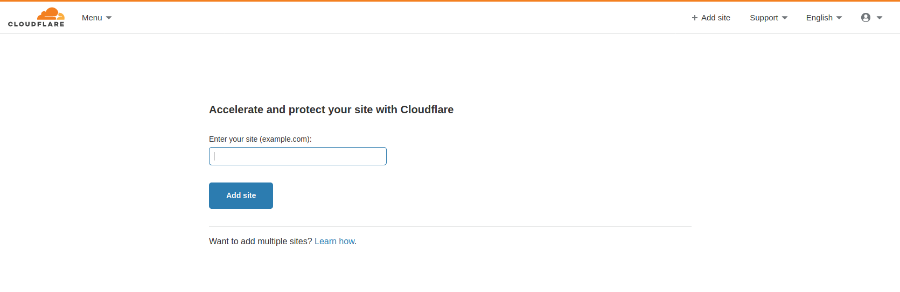
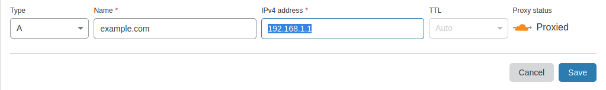
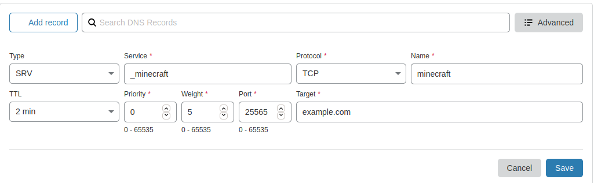

Note that this guide expects that you have purchased a domain name, and have an existing minecraft server already set up. 

The guide will go as follows:

> 1. Set up an Always Free Compute Instance with Oracle Cloud (or any cloud provider)
> 2. Import your records (if any exist) into cloudflare
> 3. Create an SRV record
> 4. Setup a reverse proxy with sslh

# [](#header-1)Setting up a Cloud server

You can set up a cloud server with any provider (aws, azure, google, digitalocean, etc...). I have chosen Oracle's "Always Free Tier" because it is Free. Other providers have similar services, however most relevant products expire after a year or less. Only Google and Oracle have servers/nodes that render free _FOREVER_. I've included links to their listings below if you would like to pick a different one:

[https://cloud.google.com/free/](Google Cloud Free Tiers)
[https://aws.amazon.com/free/](AWS Free Tiers)
[https://azure.microsoft.com/en-us/free/](Azure Free Tiers)
[https://www.oracle.com/cloud/free/](Oracle Cloud Free Tiers)

If you have picked another cloud provider, spin up a small centos 7 instance and skip to the next step. 

We are using a cloud server as another buffer between the client and our network. Once you have created an account, we will use the OCI to spin up an instance. Note that you will need to provide a credit card as proof of identity/verification. There will be a $.01 charge, but otherwise no cost so long as you only provision items in the always free category. 


# [](#header-1)Transfer your DNS records to CloudFlare


Cloudflare is a CDN (Content Delivery Network). A CDN is a large distributed network of servers around the globe. They provide several advantages for hosting content, such as caching static images, reducing bandwidth, hides the origin IP and more. In this case however, most of those features will be overlooked as cloudflare doesn't support games unless you are willing to shell out a lot of $$. 

We will be adding an SRV record, which has the draw back of revealing your origin IP. However, this will be sent to our cloud server, which will proxy the traffic back to our actual minecraft server. The main reason for adding the record with cloudflare is it should get rid of any potential beginner script kiddies as cloudflare will stop DDOS attacks with it's free tier. Most cloud providers also offer the same. The two combined, considering they are free, add a little more security and the benefit of allowing clients to connect directly over a domain name and resolve, instead of directly via an IP adress and port. 

Sign up with CloudFlare [https://dash.cloudflare.com/sign-upnaut](here)

Click the add site button at the top right, and add your domain as per below



Navigate to DNS and create an SRV record with the following parameters. Note in the example, the full domain someone would type in is minecraft.example.com. Substitute your domain name for example.com, and then feel free to change 'minecraft' to whatever subdomain you would like. Please be certain to have an A-Record created that points at your cloud server IP address.


#### [](#header-2]) The A Record (change to your IP/Domain)


#### [](#header-2]) The SRV Record


If you would like to verify that the DNS has been pulled to other resolvers, you can run the following dig command. Note that this command if you do not have it, can be installed with the bindutils/tools package. In the example provided, I have substituted the real values for fake ones and private addresses. You should see the IPv4 address you 

```bash
17:35]═╬═╬╩╦╬╧[terminalblues]$ dig SRV _minecraft._tcp.ftb-academy.landofchat.com +short
0 5 25565 dc-9bzed23c4121.example.com
17:35]═╬═╬╩╦╬╧[terminalblues]$ dig +short dc-9bzed23c4121.example.com
192.168.1.1
```


